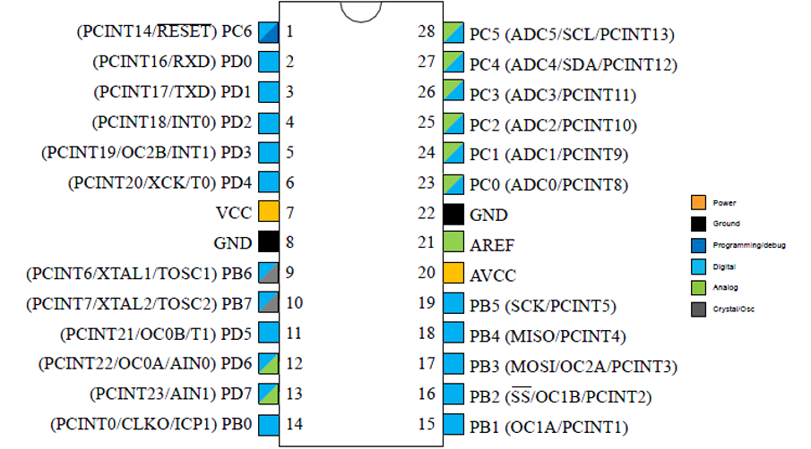

# AVR 328P Sketch
A repo for AVR sketches to build binaries for the ATmega328P RISC based microcontroller. This is setup for my local Windows environment to compile and flash the controller. The programmer of choice is USBASP V2.0.

## Using NMAKE
Since this is a Windows environment, I am currently using _nmake_ to compile and flash.
- Build the binary (.bin, .hex) files with `nmake`
- Flash the device with the .hex file using `nmake flash`
- Cleanup after yourself with `nmake clean`

## Programmer
- USBASP V2.0

## Atmega 328P Pinout

